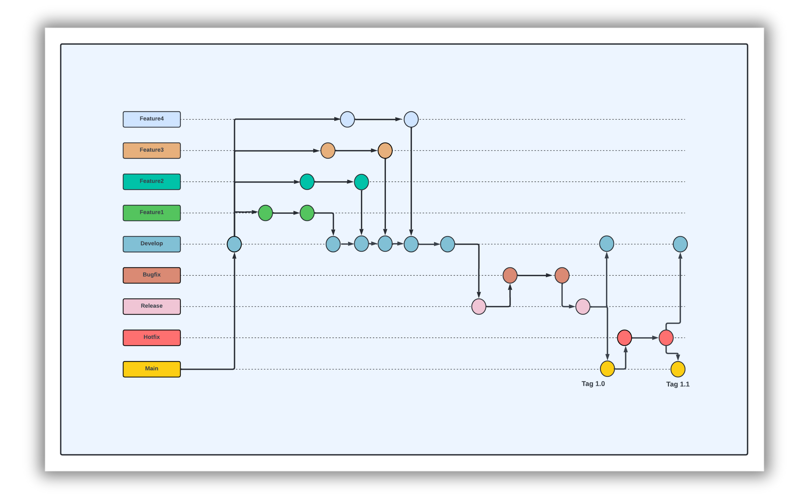

# Convention guide:

# **Goals :**

Design Prototype and re-develop a user-friendly and visually captivating clone of the `Nike.com` frontend platform and ensures seamless compatibility across multiple devices and screen sizes.

# Development Tools :

- **`Visual Studio Code` (VS Code):** A powerful and versatile code editor that provides an excellent development environment with features like syntax highlighting, debugging support, and extensions for enhanced productivity.
- **`GitLab`:** A web-based Git repository manager that offers version control, issue tracking, and continuous integration/continuous deployment (CI/CD) pipelines, facilitating collaborative software development.
- **`Figma`:** An innovative design tool used for creating user interfaces, prototypes, and collaborative design projects.
    
# Project structure :

**Description:**

- **`assets`:** a folder to store images and videos.
- **`components`:**  a folder to store reusable components.
- **`pages`:** stores each page that are responsible for.
- **`src`:** a folder to store a bunch of stylize and JavaScript.
- **`git-ignore`:** a file to store all the untracked files.
- **`index.html`:** the file that represents the landing page of the website.

# Comment rules:

**Common comments rule**: Regardless of the file type, the comments must contain a prefix followed by a **‘ : ’** and then an explanation/description.  **e.g : Nav bar: Kids page.**

# Coding-Global-color :

- **pure-white:** #FFFFFF
- black: #000000
- **light-gray:** #707072
- **red:** #9E3500
- red-pork: #E7352B
- purple: #8D429F
- **orange:** #F36B26
- **sky-blue:** #1790C8
- brown: #825D41
- Green: #7BBA3C
- yellow: #FED533
- pink: #F0728F

# Version Control:

# Commit Message :

- **`Common commit rules`:** Commits must be detailed, stating the changes made along with a short and meaningful description of the changes.
- **Commit prefixes:**
- **`Init`:** when you initialize the workspace on a new branch.
- **`Add`:** when adding a new functionality on a branch.
- **`Modify`:** when fixing something on the bug fix/hotfix branch.

**e.g : Merge: merging into the release branch with the bug fix/homepage branch**

**e.g : Merge: merging into the release branch with the bug fix/homepage branch**

# Issue naming convention :

**Issue naming :** The issues must have the issue name followed by ‘:’ and then a description of the issue at hand.

# Git-flow:

1. Branch Naming:
    - **`main`**: Main branch for production-ready code.
    - **`testing`**: Branch for testing code before deploying to production.
    - `feature/nike-clone`: Branch for merging to the develop.
    - `develop`: The finished branch for the project.
2. **Commit Messages**:
    - Write `clear`, descriptive commit messages in the imperative mood.
    - Include a brief `summary` of the changes in the commit message body.
3. **Code Reviews**:
    - Conduct code `reviews` on team member to maintain `code quality`.
    - Address any `feedback` or `issues` raised during the `review process`.

# HTML:

1. **HTML Structure**:
    - Utilize semantic `HTML` elements to structure content meaningfully.
    - Employ `indentation` to enhance code readability and maintainability.
    - Include `comments` to explain complex sections or provide context for easier understanding.
    - Ensure HTML structure is accessible, I have use Tailwind as inline.
    - `Responsive`:  Employ `Tailwind CSS` and `CSS` responsive classes to create layouts that seamlessly adapt to various screen sizes and devices.
    - Keep the `code clean` to avoid unnecessary repetition of classes.

# CSS:

1. CSS Styling:
    - `Group` related selectors and properties together. Use `comments` to delineate different sections of your CSS file, especially when dealing with complex styles.
    - `Responsive Design`: Implement `media queries` to ensure styles adapt to different screen sizes and devices.
    - `Spacing and Indentation`: Maintain consistent spacing and indentation throughout CSS file for readability. Use a consistent number of spaces (e.g., 2 or 4) for indentation.
    - Use clear `descriptive names` for classes and ID to indicate  purpose. Prefer using it with lowercase letters.
    - `Comments`: Add comments to explain the purpose of specific styles, especially for complex or non-obvious ones. Comments can also be used to mark sections of a CSS file for easier navigation.
    - `Prevent duplicate styles` or selectors by consolidating similar rules into a single declaration.

# JavaScript:

1. JavaScript Structure:
    - Organize JavaScript code into logical sections or modules, with each section focusing on a specific aspect of functionality.
    - meaningful names for variables, functions, and classes.
    - Add comments to explain the purpose of functions, complex logic, or sections of code.
    - Use event-listeners to handle user interactions and trigger appropriate actions.
    - Maintain consistent code formatting and indentation.
    - Optimize performance by minimizing unnecessary DOM manipulations, optimizing loops, and reducing the number of function calls or even- listeners where possible.
    
2. **Variable Declarations**:
    - Use **`const`** for variables that do not change their value, and **`let`** for variables that do.
    - Avoid using **`var`** as it has function scope, unlike **`const`** and **`let`** which have block scope.
    - Simplify class `iteration` using a concise loop to streamline repetitive tasks.
    

# Peer review comments :

**Common comments rule:**

- **Inline comments**: comments can be made on specific lines of code inside the peer review board.

# Checkout link source 🫶🏻:

- Figma (UI Screen, UI Prototype, Flow planning): https://www.figma.com/design/boEVi4Sr33VF3RH2NIhewi/Nike-project?node-id=0-1&t=CYa9Hz5rHmYXkt6J-1

- IA: https://www.figma.com/board/0G1UPxnqD7nN5wPCP7n32N/Nike-Clone?node-id=0-1&t=cL42CifZrqyecqlp-1

- Remote repo: https://git.clp.kr/anbschool/2nd/cybernexus/kim-chhunkea/nike-project.git

- Convention guide: [https://pewter-cry-2c1.notion.site/Nike-project-Personal-Project-5b29ebd5c56943199d45d56b6cacd5cb?pvs=4]

- Notion: https://www.notion.so/Daily-studying-8a4aef4d0655441e922d2b0eef109848?pvs=21

# Credit to:

Kim Chhunkea;

ANB School.